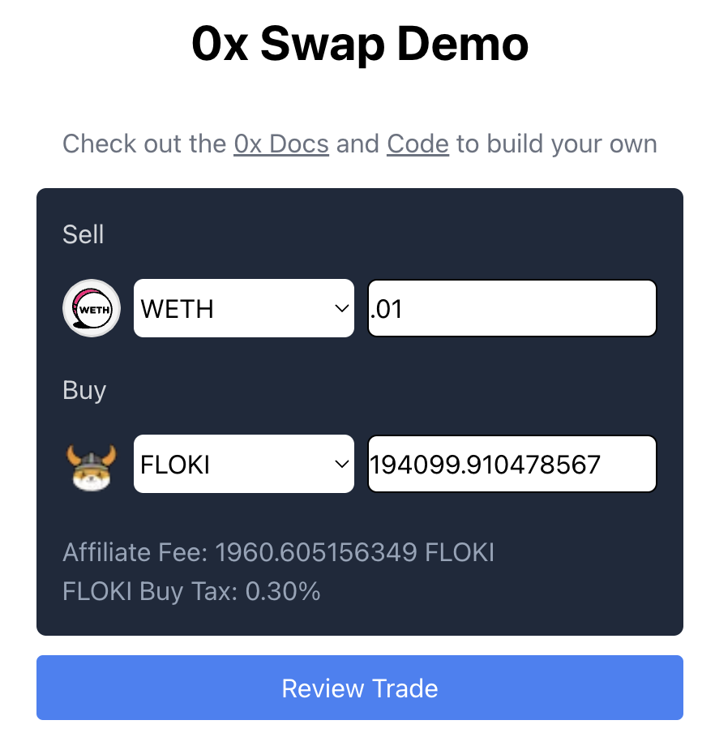
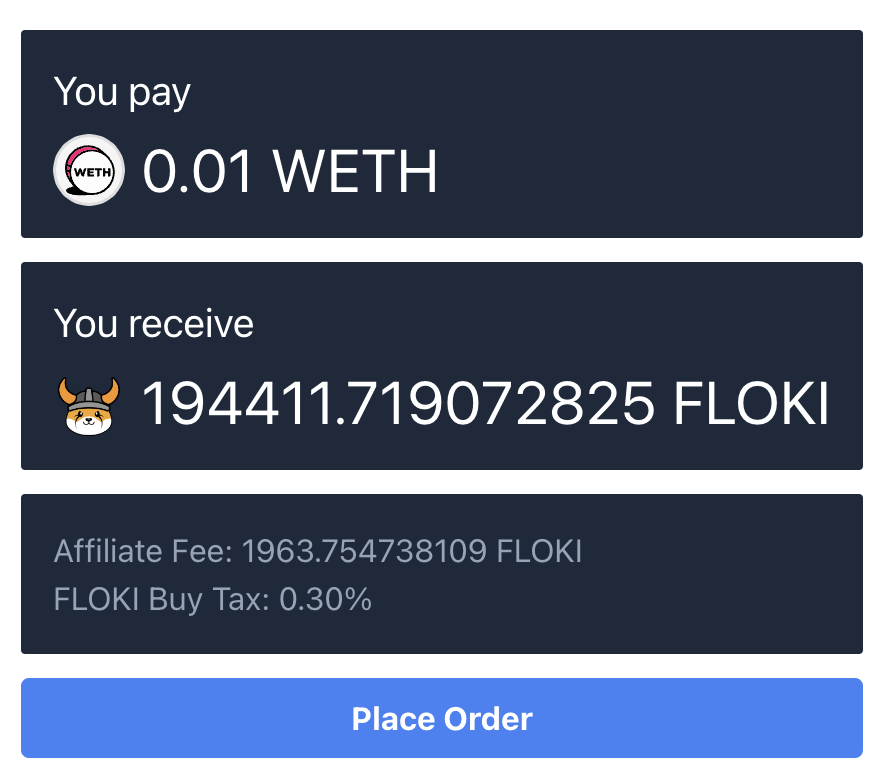

# 0x Swap API v2 Demo App (Next.js App Router)

An example ERC-20 swap application built on [Next.js App Router](https://nextjs.org/docs) with 0x Swap API v2 (Permit2) and [RainbowKit](https://www.rainbowkit.com/).

Swap API enables your users to easily and conveniently trade tokens at the best prices directly in your app. With one simple integration, 0x unlocks thousands of tokens on the most popular blockchains and aggregated liquidity from 100+ AMMs and professional market makers.

This demo app covers best practices for how to use the 0x Swap API's price endpoint for indicative pricing and the quote endpoint for firm quotes.

> [!WARNING]  
> This is a demo, and is not ready for production use. The code has not been audited and does not account for all error handling. Use at your own risk.

### Live Demo

Checkout the live demo 👉 [here](https://0x-swap-v2-demo-app.vercel.app/)

### Price View



### Quote View



Demonstrates the following on Base mainnet:

1. [Get a 0x API key](https://0x.org/docs/introduction/getting-started)
2. Get an indicative price (sell 0.1 USDC → buy WETH)
3. (If needed) Set token allowance for Permit2
4. Fetch a firm quote (sell 0.1 USDC → buy WETH)
5. Sign the Permit2 EIP-712 message
6. Submit the transaction with permit2 signature

### What is the difference between Permit2 and AllowanceHolder?

<details>

<summary>Read more about when to use AllowanceHolder vs Permit2</summary>

0x Swap API offers you the optionality to either use [Permit2](https://0x.org/docs/next/introduction/0x-cheat-sheet#permit2-contract) or [AllowanceHolder](https://0x.org/docs/next/introduction/0x-cheat-sheet#allowanceholder-contract) as the allowance target.

For most applications, we recommend using the Permit2 flow for swaps and setting allowances on the Permit2 contract. This process requires collecting two signatures from your users per trade: one offchain signature for the limited approval and an onchain signature for the trade.

While Permit2's single-use method provides greatly enhanced security, we recognize that some projects may not wish to have a double-signature UX (this may apply to teams that integrate Swap API into smart contracts, or teams that are aggregating across multiple sources and want to keep the UI consistent across all the integrations).

If your integration prevents you from collecting offchain signatures, such as with smart contracts, we recommend using AllowanceHolder.

Originally developed by Uniswap based on the work of 0x alumnus [Lawrence Forman](https://github.com/merklejerk), [Permit2](https://blog.uniswap.org/permit2-and-universal-router) is a token approval method that can be used to safely share and manage token approvals across different smart contracts. Permit2 is immutable, extensively audited, used by other trusted protocols in the space including Uniswap and has a [$3M bug bounty](https://uniswap.org/bug-bounty).

Still have questions? [Reach out to our team](https://0x.org/docs/introduction/community#contact-support).

</details>

## Getting Started

1. Create a `.env` file and setup the required environment variables

```
cp .env.example .env
```

| **API Keys**            | **Description**                                                                                                  | **Code**                                                                                     |
| ----------------------- | ---------------------------------------------------------------------------------------------------------------- | -------------------------------------------------------------------------------------------- |
| WalletConnect projectId | WalletConnect's SDK to help with connecting wallets (create one [here](https://cloud.walletconnect.com/sign-in)) | Add [here](https://github.com/0xProject/0x-examples/blob/main/swap-v2-next-app/.env.example) |
| 0x                      | 0x API key (create one [here](https://0x.org/docs/introduction/getting-started))                                 | Add [here](https://github.com/0xProject/0x-examples/blob/main/swap-v2-next-app/.env.example) |

2. Install project dependencies

```
npm install
```

3. Start the Next.js development server

```
npm run dev
```

4. Navigate to [http://localhost:3000](http://localhost:3000)

```
open http://localhost:3000
```

## Supported Networks

See [here](https://0x.org/docs/introduction/0x-cheat-sheet#-chain-support) for the latest list of supported networks.

