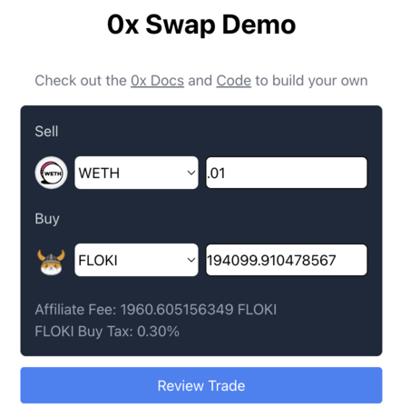
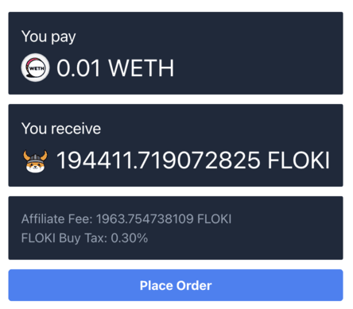

# 0x Swap API v2 Demo App (Next.js App Router)

---

> ⚠️ **WARNING — READ BEFORE USING 0x API**
>
> - **NEVER** set an allowance on the [Settler contract](https://0x.org/docs/introduction/0x-cheat-sheet#0x-settler-contracts).  
>   Doing so may lead to **loss of tokens** or **security risks**.  
>   The Settler contract does **not** require allowances — setting one enables misuse by other parties.
>
> - **ONLY** set allowances on [Permit2](https://0x.org/docs/introduction/0x-cheat-sheet#permit2-contract) or [AllowanceHolder](https://0x.org/docs/introduction/0x-cheat-sheet#allowanceholder-contract) contracts, as indicated by the API response.
>
> - The correct allowance target is returned in `issues.allowance.spender`.

> - The examples in this repo are demos, and are not ready for production use. The code has not been audited and does not account for all error handling. Use at your own risk.

---

An example ERC-20 swap application built on [Next.js App Router](https://nextjs.org/docs) with 0x Swap API v2 (Permit2) and [RainbowKit](https://www.rainbowkit.com/).

Swap API enables your users to easily and conveniently trade tokens at the best prices directly in your app. With one simple integration, 0x unlocks thousands of tokens on the most popular blockchains and aggregated liquidity from 100+ AMMs and professional market makers.

This demo app covers best practices for how to use the 0x Swap API's price endpoint for indicative pricing and the quote endpoint for firm quotes.

### Live Demo

Checkout the live demo 👉 [here](https://0x-swap-v2-demo-app.vercel.app/)

### Price View



### Quote View



Demonstrates the following on Base mainnet:

1. [Get a 0x API key](https://0x.org/docs/introduction/getting-started)
2. Get an indicative price (sell 0.1 USDC → buy WETH)
3. (If needed) Set token allowance for Permit2
4. Fetch a firm quote (sell 0.1 USDC → buy WETH)
5. Sign the Permit2 EIP-712 message
6. Submit the transaction with permit2 signature

### What is the difference between AllowanceHolder and Permit2?

<details>
<summary>Expand to read about the difference between using Permit2 and AllowanceHolder for Swap API.</summary>

The 0x Swap API supports two allowance methods: [AllowanceHolder (recommended)](https://0x.org/docs/developer-resources/core-concepts/contracts#allowanceholder-contract) and [Permit2 (advanced use only)](https://0x.org/docs/developer-resources/core-concepts/contracts#permit2-contract).

The main differences come down to **UX, gas costs, integration complexity, and integration type**.

**When to Use AllowanceHolder (Recommended)**

AllowanceHolder is the default and recommended choice for most integrators. It provides:

-   ✅ **Gas efficiency:** Lower approval and execution costs than Permit2.
-   ✅ **Safer defaults:** Reduces the chance of errors during integration.
-   ✅ **Simple UX:** Works with standard approval flows without requiring double signatures, unlike Permit2.
-   ✅ **Equal Safety:** Security guarantees are equivalent to Permit2.

AllowanceHolder is especially well-suited for:

-   Projects integrating the Swap API into smart contracts that don’t support [EIP-1271](https://eips.ethereum.org/EIPS/eip-1271).
-   Teams aggregating multiple liquidity sources and aiming for a consistent user experience across wallets.
-   Developers upgrading from Swap v1 — AllowanceHolder closely resembles the v1 integration flow.

Endpoints & Resources

-   [/swap/allowance-holder/price](https://0x.org/docs/api#tag/Swap/operation/swap::allowanceHolder::getPrice)
-   [AllowanceHolder Contract details](https://0x.org/docs/developer-resources/core-concepts/contracts#allowanceholder-contract)
-   [AllowanceHolder headless example](https://github.com/0xProject/0x-examples/tree/main/swap-v2-headless-example)


**When to Use Permit2 (Advanced Integrators Only)**

Permit2, developed by Uniswap, enables gas-efficient, flexible approvals with features like time-limited and granular allowances. It can be powerful, but it introduces **risks that new integrators must be careful with**.

**⚠️ Permit2 is for advanced integrators only.**

Key considerations:

-   Requires a double-signature flow. This is more complex to integrate but allows for features like time-limited approvals.
-   Recommended for multisig or smart contract wallets that support [EIP-1271](https://eips.ethereum.org/EIPS/eip-1271), which most do.

Permit2 is also useful if:

-   Your app needs time-limited or granular approvals not supported by AllowanceHolder.
-   Users already have infinite allowances set on Permit2 via another app — no reset is needed.

Endpoints & Resources

-   [/swap/permit2/price](https://0x.org/docs/api#tag/Swap/operation/swap::permit2::getPrice)
-   [Permit2 Contract details](https://0x.org/docs/developer-resources/core-concepts/contracts#permit2-contract)
-   [Permit2 headless example](https://github.com/0xProject/0x-examples/tree/main/swap-v2-headless-example)

Still have questions? [Reach out to our team](https://0x.org/docs/introduction/community#contact-support).


</details>

## Getting Started

1. Create a `.env` file and setup the required environment variables

```
cp .env.example .env
```


| **API Keys** | **Description** | **Code** |
| ------------ | --------------- | -------- |
| WalletConnect projectId | WalletConnect's SDK to help with connecting wallets (create one [here](https://cloud.walletconnect.com/sign-in)) | Add [here](https://github.com/0xProject/0x-examples/blob/main/swap-v2-permit2-next-app/.env.example) |
| 0x | 0x API key (create one [here](https://0x.org/docs/introduction/getting-started)) | Add [here](https://github.com/0xProject/0x-examples/blob/main/swap-v2-permit2-next-app/.env.example) |
| Ethereum RPC URL | Custom RPC URL for Ethereum mainnet (e.g., Alchemy) | Add [here](https://github.com/0xProject/0x-examples/blob/main/swap-v2-permit2-next-app/.env.example) |
| Base RPC URL | Custom RPC URL for Base mainnet (e.g., Alchemy) | Add [here](https://github.com/0xProject/0x-examples/blob/main/swap-v2-permit2-next-app/.env.example) |


2. Install project dependencies

```
npm install
```

3. Start the Next.js development server

```
npm run dev
```

4. Navigate to [http://localhost:3000](http://localhost:3000)

```
open http://localhost:3000
```

## Supported Networks

See [here](https://0x.org/docs/introduction/0x-cheat-sheet#-chain-support) for the latest list of supported networks.

